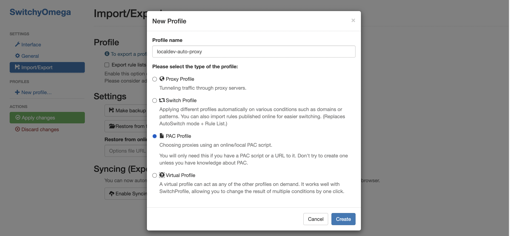

# Running a local network

(NB: this is one way to run a local network - the other is run by the
`scripts/localdev` script, which builds a minikube cluster based on 
real testnet deployments - run `scripts/localdev --help` for help -
richard@zilliqa.com 2023-03-27)


Install [kind](https://kind.sigs.k8s.io/#installation-and-usage) or `brew`.
Install [tilt](https://docs.tilt.dev/install.html) or `brew`.

Note that previous versions of this guide used a cluster called
kind` rather than `zqdev` - if you've used those you will have a
kind` cluster called `kind`.  You can either delete it, or just
change `zqdev` to `kind` in what follows. Do not attempt to run two
copies of Zilliqa on one machine - they will fight over their port
assignments.

Delete any previous dev cluster, just in case:

    ```
   kind delete cluster -n zqdev
    ```


1. Create and switch to a kind cluster.

    ```
    kind create cluster --name zqdev --config infra/kind-cluster.yaml
    kubectl config use-context kind-zqdev
    ```

1. Run Tilt to deploy the network.

    ```
    tilt up
    ```

1. Obtain the IP address of the kind cluster.

    ```
    export KIND_IP_ADDR=$(docker container inspect zqdev-control-plane --format '{{ .NetworkSettings.Networks.kind.IPAddress }}')
    ```

1. Set up a reverse proxy which will rewrite the `Host` header for requests to the cluster.
(This example uses https://mitmproxy.org/)

    ```
    mitmweb --mode reverse:http://$KIND_IP_ADDR --modify-headers '/~q/Host/l2api.local.z7a.xyz' --set web_port=8082 --no-web-open-browser
    ```

Note that `mitmweb` invokes your browser on launch. If you're running
`brave`, `brave` won't go into the background when this happens, so
`mitmweb` won't start. To "fix" this, start `mitmweb` with `--no-web-open-browser`.
You can then navigate manually to `localhost:8082` to see the UI.


1. Check on the state of your cluster in the usual ways (`kubectl`, `k9s`, etc.).
Note that it may take a while to download the container image and start up.

1. Make sure devex is configured to talk to `http://localhost:8080`.

# Enable the observability framework
1. Export the environment variable `OBSERVABILITY=True`
    ```
    export OBSERVABILITY=True
    ```

1. Run tilt to deploy the observability framework

    ```
    tilt up
    ```

# Access the observability framework

1. Set up a reverse proxy which will forward all the requests to the ingress nginx binded on `localhost:80`.
(This example uses https://mitmproxy.org/)

__ON UBUNTU ENSURE YOU ARE USING THE mitmproxy version 9.x+. https://mitmproxy.org/downloads/__


    ```
     mitmweb --mode reverse:http://localhost -p 8081 --set keep_host_header=true --set web_port=8085 --no-web-open-browser
    ```

## Browser access
1. Configure a proxy for your browser to forward all the requests for `*.local.z7a.xyz` to to mitmweb proxy
on `127.0.0.1:8081`

(This example uses Google Chrome Extension SwitchyOmega https://chrome.google.com/webstore/detail/proxy-switchyomega/padekgcemlokbadohgkifijomclgjgif)

1. Download and install the Chrome extension `proxy-switchyomega`

1. Congiure Switchyomega auto-proxy for the domain `*.local.z7a.xyz`

### Add a new auto-switch profile `localdev-auto-proxy`:




### Download the PAC file with the auto-switch proxy profile and apply the changes
(PAC file download URL: https://raw.githubusercontent.com/Zilliqa/Zilliqa/master/docs/local-network-proxy.pac)


### Select the localdev-auto-proxy profile and start browsing your localdev *.local.z7a.xyz URL


## Grafana URL: http://grafana.local.z7a.xyz
Grafana login credentials:

```bash
    username: admin
    password: admin
```

For loading dasboards, check the folder grafana_dashboards.

## Prometheus URL: http://prometheus.local.z7a.xyz

## Tempo cluster endpoint: tempo.monitoring.svc.cluster.local
Tempo is reachable only from pods inside the cluster. To forward any of its port use `kubectl port-forward`.

ie.:
    ```
    kubectl port-forward -n monitoring tempo-0 3100
    ```

## Tempo service endpoints by supported protocol:
| endpoint | Description |
|-----------| ------------|
| tempo.monitoring.svc.cluster.local:3100 | Prometheus metrics |
| tempo.monitoring.svc.cluster.local:16687 | Jaeger metrics |
| tempo.monitoring.svc.cluster.local:16686| Tempo Query Jaeger ui |
| tempo.monitoring.svc.cluster.local:6831 | Jaeger thrift compact |
| tempo.monitoring.svc.cluster.local:6832 | Jaeger thrift binary |
| tempo.monitoring.svc.cluster.local:14268 | Jaeger thrift HTTP |
| tempo.monitoring.svc.cluster.local:14250 | GPRC Jaeger |
| tempo.monitoring.svc.cluster.local:9411 | Zipkin |
| tempo.monitoring.svc.cluster.local:55680 | OTLP legacy |
| tempo.monitoring.svc.cluster.local:55681 | OTLP HTTP legacy |
| tempo.monitoring.svc.cluster.local:4317 | GPRC OLTP |
| tempo.monitoring.svc.cluster.local:4318 | OLTP HTTP |
| tempo.monitoring.svc.cluster.local:55678 | Opencensus |

## Check traces on tempo using curl

```
curl http://tmpo:3100/api/search
```


## Loki cluster endpoint: loki.monitoring.svc.cluster.local:3100
Tempo is reachable only from pods inside the cluster. To forward any of its port use `kubectl port-forward`.

ie.:
    ```
    kubectl port-forward -n monitoring loki-0 3100
    ```


# How to access the localdev resources using the mitmweb proxy http://localhost:8081 from your Linux shell environment

cURL:
```
curl -x "http://localhost:8081" http://l2api.local.z7a.xyz
```

Using the environment variable `http_proxy`
```
export http_proxy=http://localhost:8081
curl http://l2api.local.z7a.xyz
```

# Updating the network

Sadly our networks are not very resilient, so we can't rely on Kubernetes' automatic rollouts to restart nodes with a new image.
Instead, the easiest thing to do at the moment is to tear down the network and re-create it by running `tilt down`, waiting for all the pods to be deleted and then `tilt up` again.
